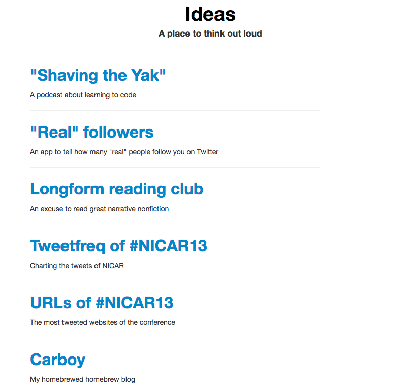
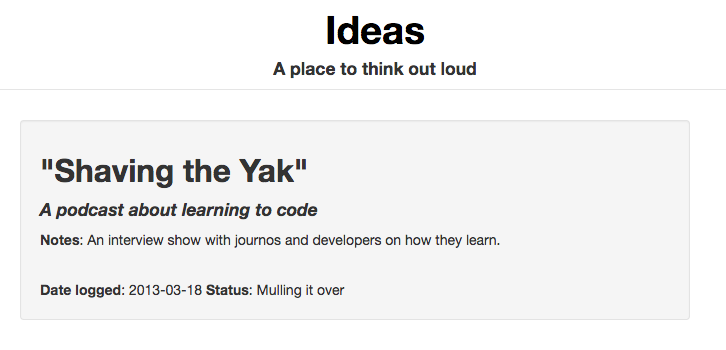
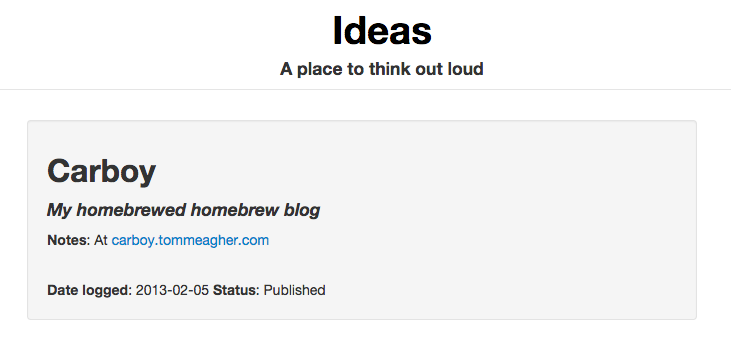

#Alva

Alva is a nanoblog application built using the Flask Python microframework.

This is a customized application based on the [basic flaskr tutorial](http://flask.pocoo.org/docs/tutorial/introduction/), styled using Twitter's [Bootstrap CSS framework](http://twitter.github.com/bootstrap/).

What have I added to the tutorial app?
- Detailed pages for each post
- The ability to edit any post
- The ability to delete any post
- A public/private option with a view enabled by session login

This application, originally hosted at http://ideas.tommeagher.com/, is no longer online or being developed. If you want to pick it up, please feel free to fork and send a pull request.

The last finished alpha version of the Flask app was v1.0. v2.0 was intended to be a Django application. The application evolved into the Carboy microblog at http://carboy.tommeagher.com, which is still being [maintained and developed](https://www.github.com/tommeagher/carboy), albeit slowly.
